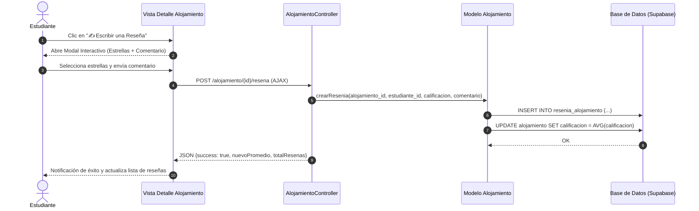

# Diseño de Especificación: Módulo Interactivo de Reseñas y Valoraciones de Alojamiento

**Fecha:** 2026-07-09  
**Enfoque:** Enfoque A — Reseñas Abiertas para Estudiantes Autenticados con Distintivo de "Estudiante Verificado"  
**Estética:** Diseño Visual Premium (`pd-*`) con modal interactivo y estrellas animadas.

---

## 1. Objetivo y Alcance
Permitir que los estudiantes universitarios autenticados publiquen calificaciones (de 1 a 5 estrellas) y comentarios sobre los alojamientos en los que han residido o visitado. El sistema recalcula en tiempo real la calificación promedio del alojamiento y resalta con un distintivo de **"Estudiante Verificado"** a aquellos inquilinos que cuentan con historial de reserva formalizada o contrato en dicho inmueble.

---

## 2. Arquitectura y Flujo de Datos

---

## 3. Componentes Técnicos a Desarrollar

### 3.1 Modelo: `app/models/Alojamiento.php`
- **`crearOActualizarResenia($alojamiento_id, $estudiante_id, $calificacion, $comentario)`**:
  - Verifica si el usuario ya dejó una reseña para ese alojamiento (mediante `estudiante_id` y `alojamiento_id`).
  - Si ya existe, actualiza su calificación y comentario. Si no existe, inserta un nuevo registro en `resenia_alojamiento`.
  - Recalcula la calificación promedio del alojamiento en la tabla `alojamiento`.
- **`verificarEstudianteResidente($alojamiento_id, $estudiante_id)`**:
  - Consulta si existe una reserva en estado `ESRE006` (FORMALIZADO) o un contrato (`ESCO001`, `ESCO002`) asociado a ese estudiante y alojamiento para añadir el badge de confianza en la vista.

### 3.2 Controlador: `app/controllers/AlojamientoController.php`
- **`public function guardarResena($id = null)`**:
  - Endpoint accesible por `POST /alojamiento/{id}/resena`.
  - Valida sesión de estudiante (`$_SESSION['usuario_id']`).
  - Procesa calificación (entero entre 1 y 5) y comentario sanitizado.
  - Devuelve respuesta estructurada JSON para refrescar la interfaz de usuario en tiempo real.

### 3.3 Interfaz Visual: `app/views/alojamiento/detalle.php` & `_resenas.php`
- **Sección Header de Reseñas**:
  - Botón **"✍️ Escribir una Reseña"** visible para usuarios que hayan iniciado sesión.
- **Modal Interactivo `pd-modal-resena`**:
  - Puntuación mediante 5 estrellas interactivas en SVG/FontAwesome con cambio de color al pasar el cursor (`hover`) y selección persistente.
  - Textarea con contador de caracteres y diseño limpio con bordes redondeados.
- **Lista de Reseñas Mejorada**:
  - Insignia **"✅ Estudiante Verificado"** en color esmeralda (`#10b981`) para quienes tengan historial de contrato/reserva.

---

## 4. Plan de Verificación
- Pruebas unitarias de inserción y cálculo de promedio en base de datos.
- Validación de que un estudiante autenticado pueda publicar su reseña y ver reflejada su calificación instantáneamente.
